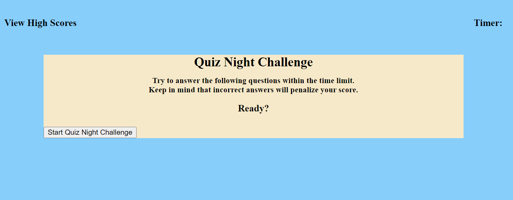

# Quiz Night

## Description

This is Challenge #4, this code includes both multiple-choice questions and interactive coding challenges. 

This Challenge builds a timed coding quiz with multiple-choice questions. This app runs in the browser and features dynamically updated HTML and CSS powered by JavaScript code.  

## Functionality

When the user clicks the Start-Quiz-Night-Challenge button, the user is presented with a series of typical Quiz Night questions.

The quiz is timed and the high score is stored.

After answering a question, the user is shown whether or not the answer is correct.  If the answer is incorrect 10 seconds is subtracted from the score.  Another question is then presented.

When all questions are answered or the timer reaches 0 the game is over.  The user can then save their initials and their score is saved.

## Appearance and Location

The following animation demonstrates the application functionality:

## Appearance and Location

The following image is a screenshot of the application:

URL: https://github.com/dawn-kline-m/QuizNight.git

## Project Status

The project is almost complete.

